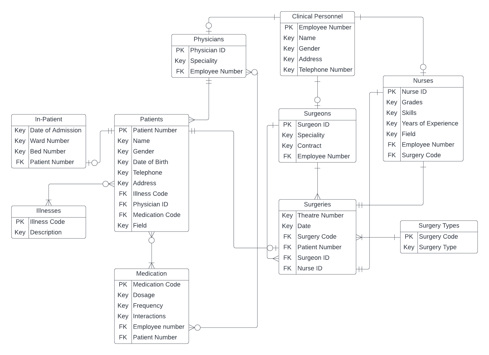

# SQL Database Creation Project

## Contents

1. [Entity-Relationship Diagram](#entity-relationship-diagram)
2. [SQL Programming](#sql-programming)
3. [Contributing](#contributing)
4. [License](#license)

## Entity-Relationship Diagram

The provided Entity-Relationship (ER) diagram visualises the relational structure of the Coventry Medical Group's database. It serves as a blueprint to understand the relationships between various entities, their attributes, and how data is interconnected.

## SQL Programming

Inside the [SQL Programming.sql](SQL Programming.sql) file, you'll find the core SQL scripts used to create, modify, and query the database. This file contains:

- Table creation scripts
- Insertion of sample data
- Commonly used queries for data retrieval
- Indexing and optimisation scripts
